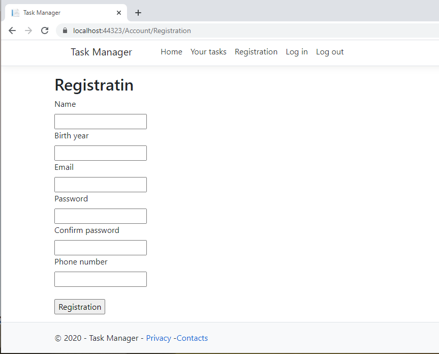

# Task-Manager

<h3>Home page: 
 
Here you can log in or register a new account if you dont have one. 
Registration page: 
 
Login page: 
 
After signing in you return to the home page, where there are numbers of you unfinished tasks and your name 
 
In the "Your tasks" tab there are list of your tasks, grouped by 4 categories:"For every day", "Deadline", "For today" and "General" 
 
 
If you need to change information about a task or change its category you can click on the button "edit" and on a separate page correct task information 
 
 
 
</h3>
